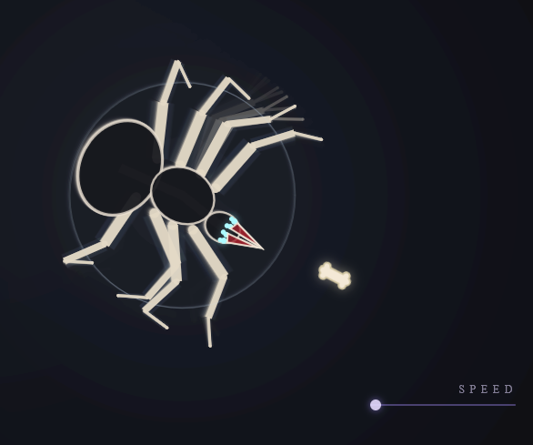

# Sepulcher Spider

An eerie, skeletal arachnid that stalks your cursor through procedural inverse-kinematics and fluttering bone wings.

## Features
- **Procedural locomotion** – IK-driven legs with adaptive swing arcs keep the spider grounded and creepy.
- **Ghostly ambience** – layered gradients, glow trails, and a sigil signature set a sepulchral mood.
- **Bone cursor** – a custom skeletal pointer replaces the system cursor for extra unease.
- **Speed control** – a minimalist slider lets you tune how aggressively the spider hunts your pointer.

## Usage
1. Clone the repository locally.
2. Open `index.html` in any modern browser.
3. Move the cursor to watch the spider pursue it; adjust the bottom-right slider to change pursuit speed.

## Controls
- **Speed Slider** – drag left/right to decrease or increase the spider’s chase velocity.

## Attribution
Crafted by Mushkarin Dmitry (Mushkarin Dmitry). All rights reserved.
